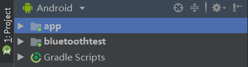

# BlueToothManager
基于AIDL实现的简易蓝牙扫描程序


## 使用

开发环境使用 Android Studio，平台API在Android 4.4以上均可

项目有两个Module：



* app: 作为AIDL服务端，用于蓝牙定时扫描，并传回数据给客户端Module
* bluetoothtest: 作为AIDL客户端，用于绑定服务端，定时获取蓝牙设备，并实时显示在界面上


## AIDL文件

服务端和客户端组件都定义如下的AIDL文件：

```java
// IBlueToothService.aidl
package com.lzy.bluetoothmanager;

// Declare any non-default types here with import statements
import com.lzy.bluetoothmanager.RmBluetoothDevice;

interface IBlueToothService {

    List<RmBluetoothDevice> getDevices();

}
```

```java
// RmBluetoothDevice.aidl
package com.lzy.bluetoothmanager;

parcelable RmBluetoothDevice;

```


## 关于

本程序可供 Android 初学者学习之用，作为AIDL技术的一个简单示例应用


